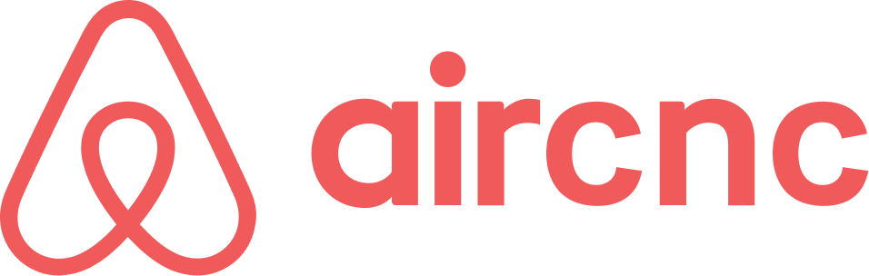
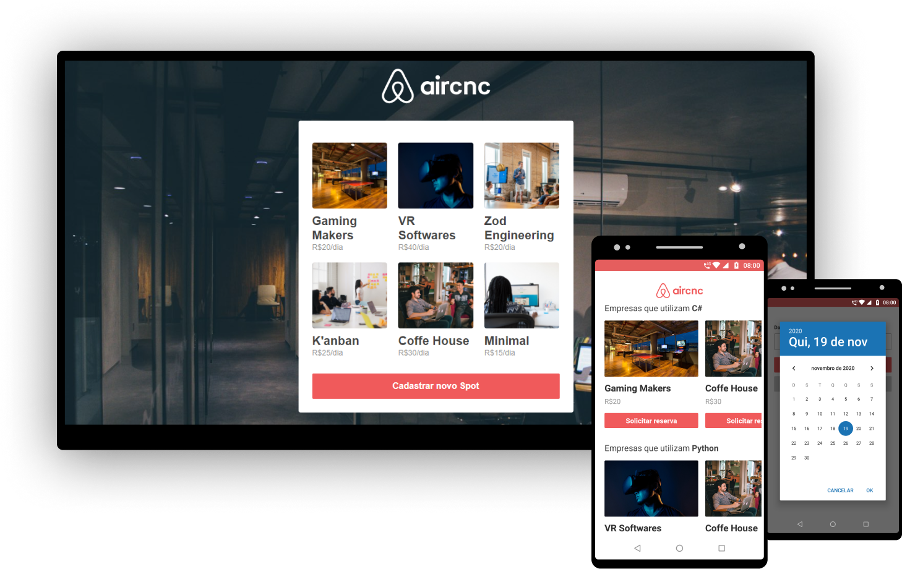

<h1 align="center">
  
</h1>

<h3 align="center">
  Aircnc - Find and book the best spots for devs. (Air Coffee & Code)
</h3>
<br>

>This project was developed for study during the "_Semana Omnistack #9_" workshop conducted by Rocketseat, it contains my own modifications to improve the project.

<p align="center">
  
</p>

<!-- Table of Contents -->
## Table of Contents

* [About the Project](#about-the-project)
  * [Technologies](#technologies)
    * [Backend](#backend)
    * [Web](#web)
    * [Mobile](#mobile)
* [Getting Started](#getting-started)
  * [Requirements](#requirements)
  * [Installation](#installation)
* [License](#license)
* [Contact](#contact)

<!-- About the Project -->
## About the Project

Aircnc is a spot scheduling system for developers and technology enthusiasts. The system has a web and mobile version: 

  - In the web version it is possible to register Spots and approve/deny a scheduling request for a given day at a given Spot. 
  - In the mobile application it is possible to search for Spots that work with certain technologies, list these Spots and make an appointment. 

The scheduling works in real time, as soon as a user requests an appointment the backoffice receives this request and can approve or deny it. After the backoffice decides whether to approve the schedule or not, an alert is displayed on the app informed of the response to the request.


### Technologies

>The system consists of a backend, web and mobile frontend, below is the list of technologies used for its construction.

#### Backend

- Cors
- Dotenv
- Eslint
- Express
- Mongoose
- Multer
- Node.js
- Prettier
- Socket.io

#### Web

- Axios
- Eslint
- Prettier
- React
- Socket.io
- Styled-components

#### Mobile

- Axios
- Eslint
- Expo
- Prettier
- React-Native
- Socket.io
- Styled-components

<!-- Getting Started -->
## Getting Started

>For the applications to work, some tools installed on your machine are required.

### Requirements

- [Node.js](https://nodejs.org/en/)
- [MongoDB](https://www.mongodb.com/) (To not need to install MongoDB you can use MongoDB Atlas)
- [Expo](https://expo.io/)

### Installation

**First clone the project**

```sh
  git clone https://github.com/haarlemnn/aircnc
```

**Launch the backend server**

_Attention: Make sure to create your **.env** file based on the **.env.example** sample file_

```sh
  # Access the server folder
  cd server

  # Install the dependencies
  yarn

  # Run the server
  yarn dev
```

**Launch the web application**

_Attention: Make sure that **"web/src/services/api.js"** and **"web/src/services/socket.js"** have the IP and the port on which your backend server is running._

```sh
  # Access the web folder
  cd web

  # Install the dependencies
  yarn

  # Start the client
  yarn start
```

**Launch the mobile application**

_Attention: Make sure that **"mobile/src/services/api.js"** and **"mobile/src/services/socket.js"** have the IP and the port on which your backend server is running._

have the IP to your API

```sh
  # Access the mobile folder
  cd mobile

  # Install the dependencies
  yarn

  # Start the expo service and scan the QR code with Expo Client
  yarn start
```
<!-- License -->
## License
This project is licensed under the [MIT License](LICENSE)

## Contact
>You can connect and talk to me through my [LinkedIn](https://www.linkedin.com/in/haarlem-notoroberto/).
